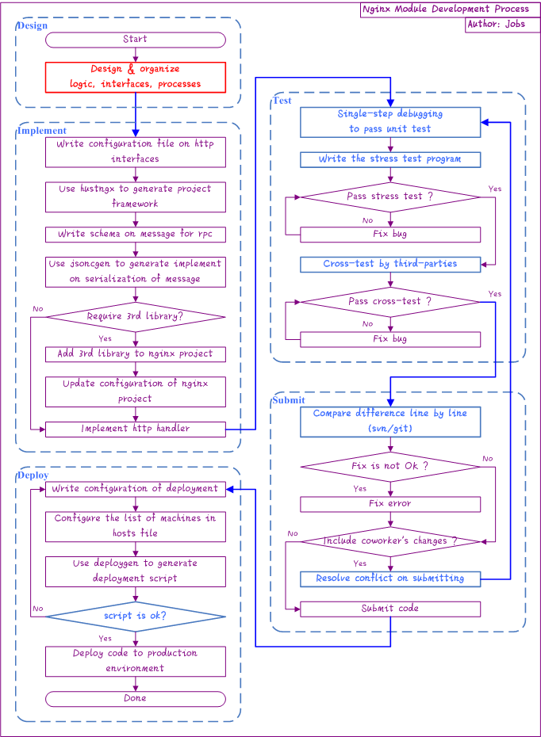

Nginx Module Development Process
--

### Process flow chart ###

### Keys on process flow ###

- **Red marked process is usually more concerned by experienced developers, and vice versa**  
- **The most easily overlooked, but accident-prone process is marked by blue**  
- Refer to [ngx_wizard](../advanced/ngx_wizard.md) for configuration on http interfaces  
- Refer to [jsoncgen](../advanced/jsoncgen.md) for configuration on communication message  
- Refer to [appendix](../appendix/project.md) for nginx project & configuration  
- **Unit-test, pressure-test and cross-test** is the key to ensure the availability of service. **Any step can not be omitted**.  
    - Unit-test is used to ensure availability of service's basic functions. You can **go through every logical branch of the program** by step debugging.  
    - Pressure-test is used to ensure that **there is no problem of any leakage of resources** in the case of repeated processing of a large number of requests. Pressure-test scripts are usually done by person who developed the module.  
    - The cross-test are usually performed by **third-parties** (can not be performed by the person who developed the module) to ensure the fault-tolerance and high availability of service.  
- The process on submitting code to repository is easily overlooked by developers.  
	- If only one developer is involved in the project, the process can be ignored.  
	- If **more than one developer** works in parallel, the process must be strictly enforced. Otherwise **unexpected code will be submittd**, which will result in **inefficient troubleshooting**   
- Refer to [deploygen](../advanced/deploygen.md) for configuration on deployment  
- The last step before being online is to check the deployment script, which **could not be omitted**. Otherwise **it will directly affect the stable operation of online service** once the deployment is in trouble, which will result in incalculable loss. The check points include:  
	- Whether the deployment command is correct. You can run the script on test machines to verify the result.  
	- Whether the list of machines for deployment is correct. You can verify it by text comparison tool.  

[Previous](index.md)

[Home](../index.md)