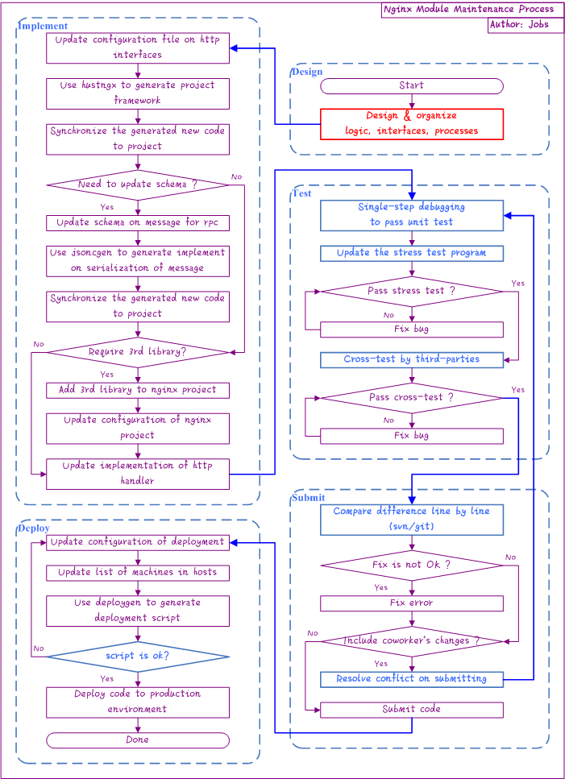

Nginx Module Maintenance Process
--

### Process flow chart ###

### Keys on process flow ###

- Refer to [Nginx Module Development Process](development.md)  

### Code synchronization ###

Assume that we have a project named `hustmqha` under folder `/data/src/hustmqha`, you can **synchronize new code (generated by `hustngx`, for example) to project** in implementation phase as below:  

1. Update [configuration](../advanced/ngx_wizard.md) of `ngx_wizard`.  
2. Use `hustngx` and updated configuration to generate **a new project** , assumed to be `/data/tools/hustngx/hustmqha`.  
3. Compare `/data/tools/hustngx/hustmqha` and `/data/src/hustmqha` with the text comparison tool (for example, `Beyond Compare`), and synchronize the new part of `/data/tools/hustngx/hustmqha` to `/data/src/hustmqha` **line by line**.  
4. If you need to add new interface for service, repeat the above steps.  

[Previous](index.md)

[Home](../index.md)