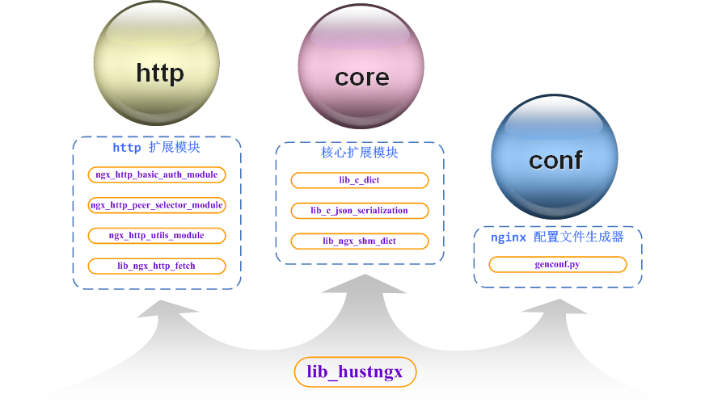

lib_hustngx
--

`lib_hustngx` 提供了一套用于 nginx 模块开发的基础组件，包含如下组件：

* [核心扩展模块](lib_hustngx/core_module.md)
* [http 扩展模块](lib_hustngx/http_module.md)
* [nginx 配置文件生成器](lib_hustngx/genconf.md)

[回上页](index.md)

[回首页](../index.md)